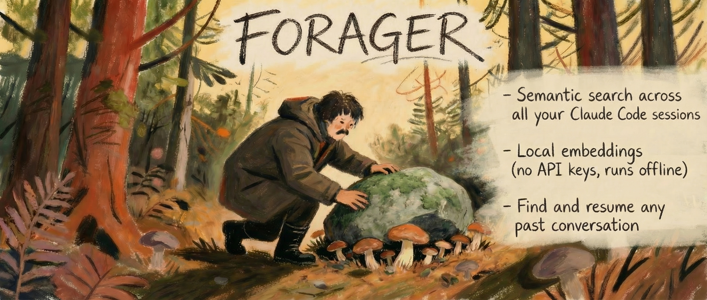

# session-forager

Forage through your Claude Code session history with semantic search. Find and resume any past conversation.

## Install

```bash
npm install -g session-forager
```

## Quick Start

```bash
forager index            # Index all sessions (first run downloads ~22MB embedding model)
forager setup            # Auto-index daily (launchd on macOS, cron on Linux)
```

## Usage

```bash
forager search "that auth bug I fixed"
```

```
 1. [0.87] Implementing OAuth2 login flow (Jan 22)
    Project: ~/myproject  Branch: feature/auth
    Resume: claude --resume e75b8241

 2. [0.71] Sandbox Mode Setup Explained (Dec 27)
    Project: ~
    Resume: claude --resume b4905ee8
```

```bash
forager resume 1         # Resume result #1 from last search
forager resume e75b8241  # Or by session ID prefix
```

### All Commands

| Command | Description |
|---------|-------------|
| `forager index` | Index all sessions (incremental — skips unchanged) |
| `forager index --full` | Re-index everything from scratch |
| `forager search "query"` | Semantic search across all sessions |
| `forager search "query" -n 10` | Return more results |
| `forager resume <id>` | Resume a session by ID prefix or result number |
| `forager stats` | Show index statistics |
| `forager setup` | Install daily auto-indexing |
| `forager teardown` | Remove daily auto-indexing |

## What Gets Indexed

Forager scans three sources, so nothing gets missed:

1. **Session indexes** (`~/.claude/projects/*/sessions-index.json`) — sessions with summaries and metadata
2. **Orphaned JSONL files** — session transcripts without an index entry
3. **Prompt history** (`~/.claude/history.jsonl`) — every prompt ever typed, grouped into sessions

Each session is embedded locally using [all-MiniLM-L6-v2](https://huggingface.co/Xenova/all-MiniLM-L6-v2) (384-dim vectors, runs via ONNX in Node.js). Embeddings and metadata are stored in a local SQLite database at `~/.claude/session-memory.db`.

## How It Works

- Embeddings run 100% locally via `@huggingface/transformers` — no API keys, no network calls after first model download
- Incremental indexing: only processes new or modified sessions
- `forager setup` installs a **launchd agent** on macOS (no permission prompts, catches up after sleep) or a **cron job** on Linux
- Search uses cosine similarity against all stored embeddings

## Requirements

- Node.js 18+
- Claude Code (the session data it generates)
